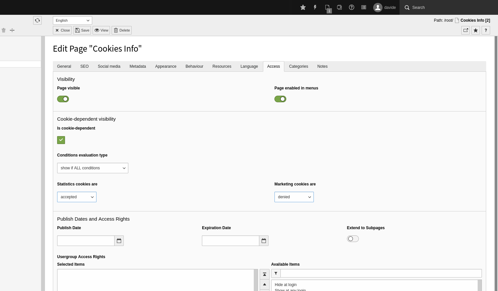
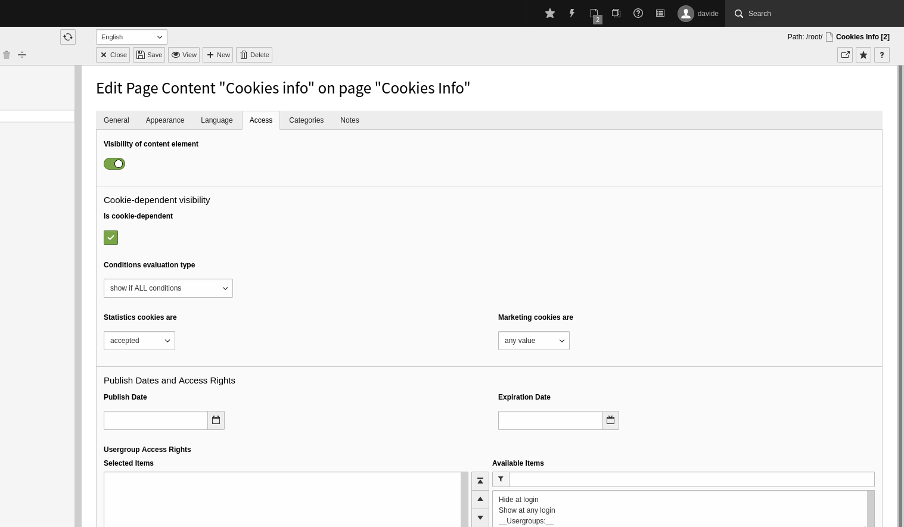

# Cookie Consent Plus

Cookie Consent Plus adds some new features to Dirk Persky's Cookie Consent extension ([dp_cookieconsent](https://extensions.typo3.org/extension/dp_cookieconsent))

## Current features

* Dependence on cookies for page visibility
* Dependence on cookies for content element visibility

## Screenshots

## Links

|||
| --- | --- |
| Documentation / Manual |  |
| TYPO3 extension repository |  |
| Source code | <https://github.com/davide-alghi/typo3-cookieconsent-plus> |
| Issues / Bugs | <https://github.com/davide-alghi/typo3-cookieconsent-plus/issues> |
| Contributions (Pull requests are welcome) | <https://github.com/davide-alghi/typo3-cookieconsent-plus/pulls> |
| Packagist |  |

## Contact

Private messages: <info@penguinable.it>.

`Penguinable`
